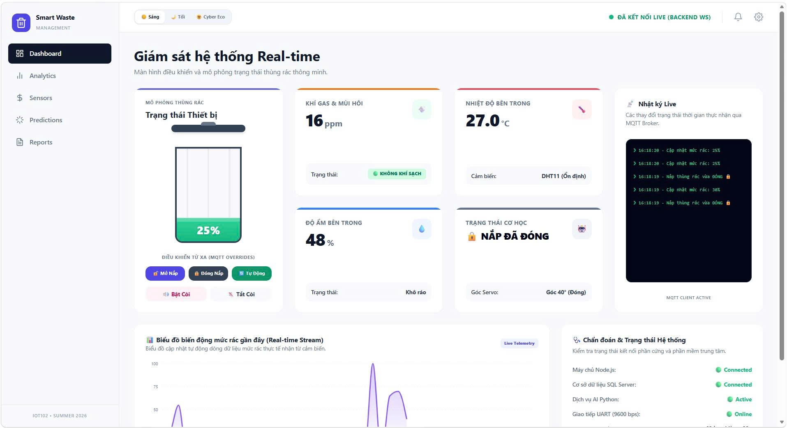
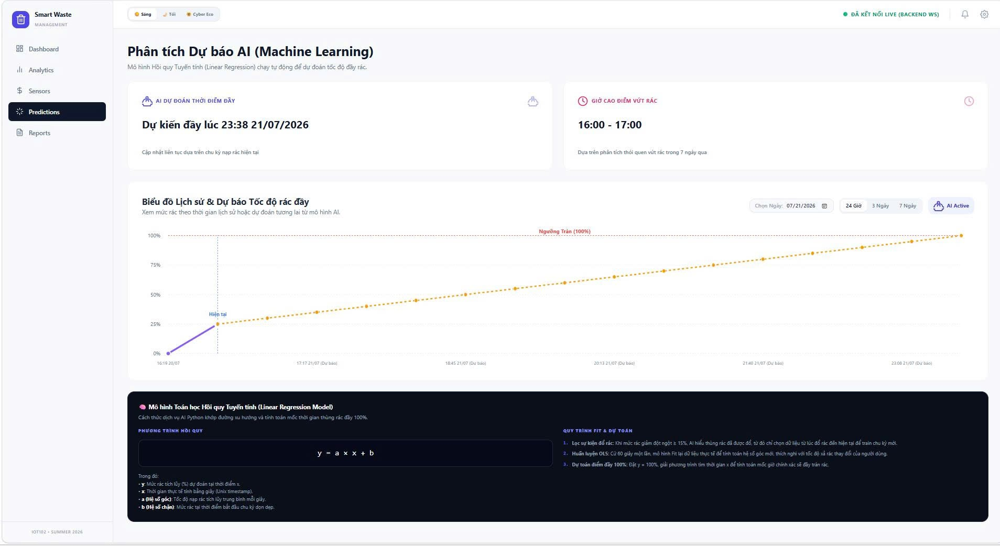
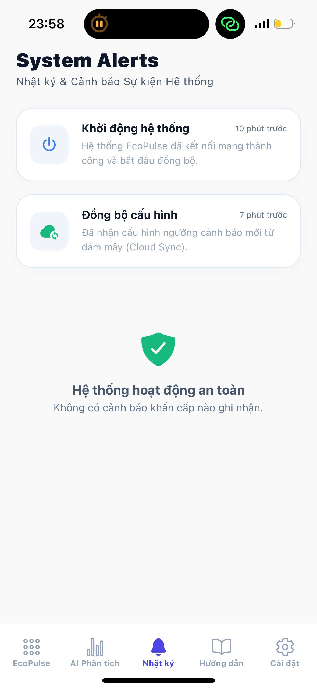
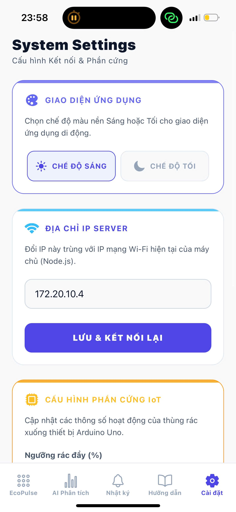
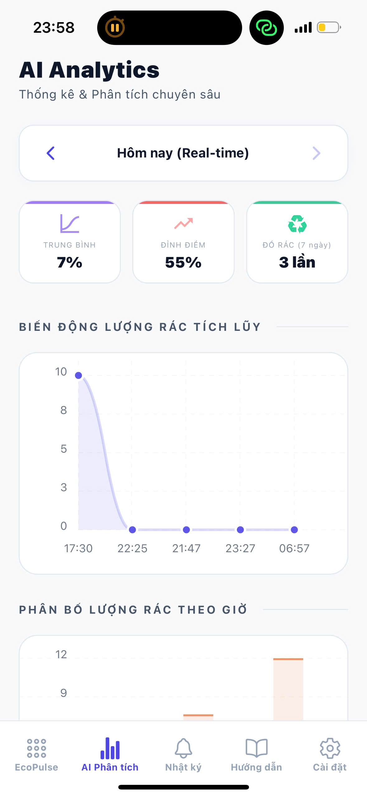

# 🗑️ Smart Waste Management IoT (Thùng Rác Thông Minh Tích Hợp AI)

Dự án **Hệ thống Giám sát & Quản lý Thùng Rác Thông Minh Cao Cấp dành cho Smarthome**, ứng dụng công nghệ **IoT (Internet of Things)** và **Trí tuệ nhân tạo (Machine Learning)** để tự động hóa quá trình thu gom rác, cảnh báo cháy nổ, giám sát chất lượng không khí và dự báo thời gian đầy rác theo thời gian thực.

---

## 🌟 Tính năng nổi bật

- **Tự động đóng/mở nắp thông minh:** Sử dụng động cơ Servo công nghiệp nhông kim loại **MG996R (lực kéo 10kg/cm)** để đóng mở nắp thùng kim loại/nhựa đúc êm ái, chống kẹt.
- **Cảnh báo Báo cháy & Khí Gas rò rỉ:** Tích hợp cảm biến **MQ-135** phát hiện rò rỉ khí gas hoặc nguy cơ cháy nổ. Kích hoạt còi hú báo động tại chỗ qua loa **DFPlayer Mini** và gửi thông báo đỏ lên Web/App.
- **Giám sát Môi trường Real-time:** Đo lường liên tục Nhiệt độ, Độ ẩm (**DHT11**) và Nồng độ khí gas/mùi hôi (**MQ-135**).
- **Cấu hình Động từ xa (Dynamic IoT Configuration):** Thay đổi linh hoạt các ngưỡng hoạt động ngay trên Web/App và lưu vĩnh viễn vào **EEPROM Arduino**:
  - Ngưỡng cảnh báo đầy rác (%)
  - Ngưỡng cảnh báo khí Gas (ppm)
  - Ngưỡng nhiệt độ báo động đỏ (°C)
  - Chiều cao lòng thùng rác (cm)
  - Âm lượng loa cảnh báo (0 - 30)
- **Machine Learning (AI Dự báo):** Thuật toán Hồi quy tuyến tính (**Linear Regression**) bằng Python (`predict.py`) phân tích lịch sử để **dự đoán chính xác thời điểm thùng rác sẽ đầy 100%** và phân tích khung giờ cao điểm, tự động lọc nhiễu các điểm dữ liệu bất thường.
- **Giao tiếp Siêu tốc & An toàn:** Kết hợp mạng **MQTT (Pub/Sub)** cho vi điều khiển và **WebSockets (Socket.IO)** cho ứng dụng di động & website. Lọc nhiễu JSON ngay tại vi mạch ESP8266 (Edge Computing).
- **Thiết kế Nguồn & Mạch an toàn:** Khối pin **11.1V (6800mAh)** qua module giảm áp **LM2596 Buck Converter (5V-3A)** nuôi riêng Servo & MCU. Mạch phân áp điện trở 220Ω/330Ω bảo vệ chân RX 3.3V của ESP8266.

---

## 🛠 Kiến trúc Hệ thống & Linh kiện Phần cứng

### 1. Lớp Phần cứng (Hardware - Edge Devices)
- **Arduino Uno R3:** Vi điều khiển trung tâm, xử lý đọc cảm biến thời gian thực, điều khiển Servo MG996R, loa DFPlayer Mini và LCD 1602.
- **ESP8266 NodeMCU:** Gateway mạng Wi-Fi/MQTT, kết nối nối tiếp với Arduino qua SoftwareSerial (chân D11, D12) và mạch phân áp hạ 5V ➔ 3.3V.
- **Khối Cảm biến:** 
  - 1 x Siêu âm HC-SR04 (Đo khoảng cách rác)
  - 1 x DHT11 (Nhiệt độ & Độ ẩm)
  - 1 x MQ-135 (Chất lượng không khí / Khí Gas)
- **Cơ cấu Chấp hành & Điện nguồn:** 
  - Động cơ Servo MG996R (10kg/cm, nhông kim loại)
  - Module phát âm thanh DFPlayer Mini + Loa 3W
  - Mạch giảm áp LM2596 Buck Converter (Hạ 11.1V ➔ 5V 3A)
  - Pin 3S Li-ion 11.1V (6800mAh)
  - Màn hình LCD 1602 I2C

### 2. Lớp Backend & Data Center
- **MQTT Broker:** Eclipse Mosquitto (Cổng 1883).
- **Cơ sở dữ liệu:** Microsoft SQL Server (`SmartWasteDB` lưu lịch sử đo đạc).
- **Backend Server:** Node.js + Express.js + Socket.IO + `pymssql` (`src/backend/server.js`).
- **AI Service:** Script Python (`src/ml/predict.py`) chạy ngầm, sử dụng `scikit-learn` & `pandas`.

### 3. Lớp Giao diện Người dùng (Frontend & Mobile)
- **Web Dashboard:** React 18 + Vite + Tailwind CSS (`src/frontend`).
- **Mobile Application:** React Native + Expo (`src/mobile`).

---

## 📁 Cấu trúc Thư mục Dự án

```
IOT102_Project/
├── docs/                      # Tài liệu AI Audit Log & Báo cáo đồ án
├── src/
│   ├── backend/               # Server Node.js (REST API, WebSockets, SQL Server)
│   ├── frontend/              # Giao diện Web Dashboard (React, Vite, Tailwind)
│   ├── iot/                   # Firmware phần cứng (code_arduino.ino, code_esp8266.ino)
│   ├── ml/                    # Module AI Machine Learning (predict.py)
│   └── mobile/                # Ứng dụng di động (React Native, Expo)
└── README.md                  # Hướng dẫn dự án
```

---

## 🚀 Hướng dẫn Cài đặt & Khởi chạy Dự án

### 1. Khởi chạy Backend Server & SQL Database
1. Đảm bảo **SQL Server** đang chạy trên máy (User: `sa`, Pass: `12345`).
2. Mở Terminal tại thư mục `src/backend`:
   ```bash
   cd src/backend
   npm install
   node server.js
   ```
   *(Server sẽ tự động khởi tạo Database `SmartWasteDB` và các bảng dữ liệu nếu chưa tồn tại).*

### 2. Khởi chạy Dịch vụ AI Machine Learning
Mở Terminal mới tại thư mục `src/ml`:
```bash
cd src/ml
pip install -r requirements.txt
python predict.py
```

### 3. Khởi chạy Giao diện Web Dashboard
Mở Terminal mới tại thư mục `src/frontend`:
```bash
cd src/frontend
npm install
npm run dev
```

### 4. Khởi chạy Ứng dụng Mobile App
Mở Terminal mới tại thư mục `src/mobile`:
```bash
cd src/mobile
npm install
npm start
```

### 5. Nạp Firmware Phần cứng
1. Nạp file `src/iot/code_arduino.ino` vào mạch **Arduino Uno**.
2. Nạp file `src/iot/code_esp8266.ino` vào mạch **ESP8266**.
3. **Lưu ý Cấp nguồn:** Sử dụng khối pin 11.1V qua mạch LM2596 chỉnh áp đầu ra đúng **5.0V** để cấp nguồn riêng cho Servo MG996R và Arduino. *Tuyệt đối không cấp nguồn cho Servo trực tiếp từ chân 5V của Arduino UNO để tránh cháy bo mạch.*

---

## 📸 Hình ảnh Giao diện Web & Mobile App (Showcase)

### 1. Web Dashboard (Giám sát Real-time & Phân tích AI)
| Web Dashboard Giám sát Real-time | Phân tích & Dự báo AI (Linear Regression) |
| :---: | :---: |
|  |  |

### 2. Ứng dụng Di động (EcoPulse IoT - React Native App)
| Màn hình Chính & Command Center | Thống kê & Phân tích AI | Nhật ký & Cảnh báo Hệ thống |
| :---: | :---: | :---: |
|  |  |  |

---

## 📝 Giấy phép & Bản quyền

Dự án được thực hiện bởi sinh viên **Lê Thanh Tùng (MSSV: SE203438)** cho môn học **IOT102** tại Đại học FPT.

