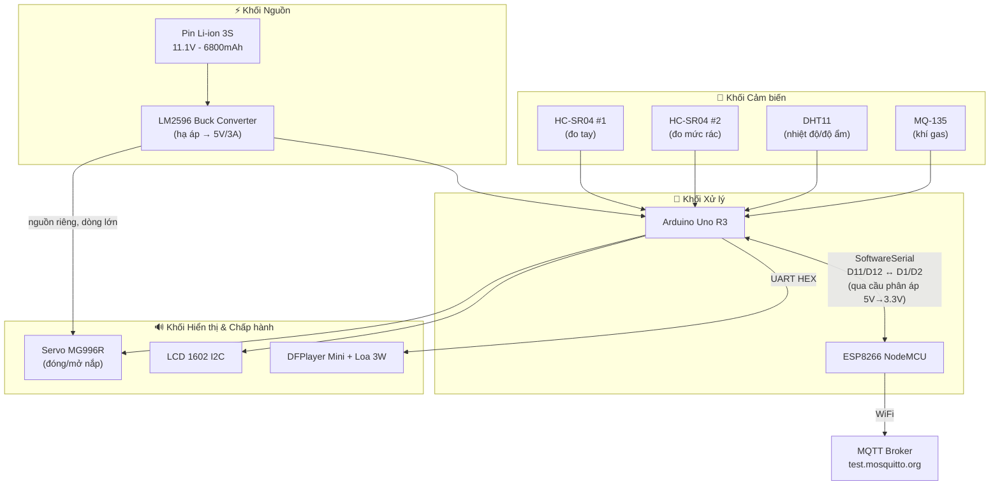

# 🔩 Kiến thức Phần cứng: Hệ thống Smart Bin (IOT102)

Tài liệu này tổng hợp và trình bày lại phần tìm hiểu của nhóm về **linh kiện phần cứng** trong hệ thống Thùng Rác Thông Minh, đối chiếu trực tiếp với firmware thật trong [`src/iot/code_arduino.ino`](src/iot/code_arduino.ino) và [`src/iot/code_esp8266.ino`](src/iot/code_esp8266.ino) để đảm bảo số chân, thông số là chính xác 100% — dùng để cả team nắm hệ thống và **trả lời bảo vệ đồ án**.

> Tài liệu về **kỹ thuật lập trình** (millis, EEPROM, struct...) xem tại [`tong_ket_kien_thuc_smartbin.md`](tong_ket_kien_thuc_smartbin.md). Tài liệu này chỉ nói về **linh kiện vật lý**.

---

## 0. Khung trình bày dùng chung (Framework)

Để mọi thành viên viết/đọc tài liệu linh kiện theo cùng một chuẩn, mỗi linh kiện được mô tả theo **7 mục cố định** sau. Khi thêm linh kiện mới vào hệ thống, hãy copy khung này:

| # | Mục | Nội dung cần điền |
|---|-----|--------------------|
| 1 | **Tên & Vai trò** | Tên linh kiện, model cụ thể, vai trò trong hệ thống (input hay output, đo gì / điều khiển gì) |
| 2 | **Thông số kỹ thuật** | Điện áp hoạt động, dòng tiêu thụ, giao tiếp (Analog/Digital/I2C/UART/PWM), tầm đo/độ chính xác |
| 3 | **Chân kết nối** | Chân trên linh kiện ↔ chân trên Arduino/ESP8266 (số chân thật, không phải chân ví dụ) |
| 4 | **Nguyên lý hoạt động** | Cơ chế vật lý/điện tử bên trong khiến nó đo được / xuất tín hiệu được |
| 5 | **Cách dùng trong code** | Hàm/thư viện nào đang gọi tới nó, link dòng code thật |
| 6 | **Yêu cầu & Lưu ý lắp đặt** | Nguồn riêng? Điện trở bảo vệ? Sai số cần bù? Rủi ro cháy/hỏng nếu lắp sai |
| 7 | **Câu hỏi hay bị hỏi khi bảo vệ** | Câu hỏi giáo viên thường đặt ra + gợi ý trả lời ngắn |

---

## 1. Kiến thức nền tảng (đọc trước nếu bạn mới bắt đầu)

Phần này giải thích các thuật ngữ phần cứng cơ bản mà mục 4-8 phía dưới sẽ dùng liên tục. Nếu bạn đã quen thuộc, có thể bỏ qua thẳng tới mục 2.

### 1.1. Bộ nhớ trên vi điều khiển (RAM / Flash / EEPROM)

Một chip như ATmega328P (trên Arduino Uno) có **3 loại bộ nhớ khác nhau** — đây là điểm hay bị nhầm lẫn nhất với người mới:

| Loại bộ nhớ | Dùng để làm gì | Mất dữ liệu khi cúp điện? | Dung lượng trên Uno | Xuất hiện ở đâu trong dự án |
|---|---|---|---|---|
| **Flash** | Lưu **chương trình** (code đã nạp) | Không | 32KB | Toàn bộ file `.ino` sau khi upload được lưu ở đây |
| **RAM (SRAM)** | Lưu **biến đang chạy** (giá trị tạm thời trong lúc code thực thi) | **Có** — mất sạch khi cúp điện | Chỉ 2KB | Các biến như `handDistance`, `intGasValue`... |
| **EEPROM** | Lưu **dữ liệu cần giữ lại** dù cúp điện (cấu hình người dùng) | Không | 1KB | `struct ConfigData` — ngưỡng đầy rác, ngưỡng gas, âm lượng... xem [`code_arduino.ino:76-84`](src/iot/code_arduino.ino#L76-L84) |

> **Vì sao dự án dùng `#define PIN 10` thay vì `int PIN = 10;`?** Vì `#define` chỉ là lệnh "tìm-thay thế chữ" lúc biên dịch (compile-time), không hề chiếm byte nào trong RAM lúc chạy — quan trọng vì Uno chỉ có vỏn vẹn 2KB RAM, tốn 1 byte cũng phải cân nhắc.

### 1.2. Chân Digital vs Chân Analog

- **Chân Digital (D0-D13 trên Uno):** Chỉ hiểu **2 mức**: HIGH (~5V, coi là số 1) hoặc LOW (0V, coi là số 0) — giống công tắc bật/tắt. Dùng để: đọc Trig/Echo của HC-SR04, đọc Data của DHT11, phát xung điều khiển Servo.
  - Chân Digital phải khai báo chiều trước khi dùng: `pinMode(chân, OUTPUT)` (Arduino xuất điện áp ra, ví dụ chân Trig) hoặc `pinMode(chân, INPUT)` (Arduino đọc điện áp vào, ví dụ chân Echo).
- **Chân Analog (A0-A5 trên Uno):** Đọc được **điện áp liên tục** từ 0V đến 5V, không chỉ 2 mức. Bên trong chip có mạch **ADC (Analog-to-Digital Converter)** 10-bit, quy đổi điện áp đó thành một số nguyên từ **0 đến 1023** (2¹⁰ = 1024 mức). Dùng cho MQ-135 (`analogRead(MQ135_PIN)` → ra số 0-1023 tỉ lệ với nồng độ khí gas).
- **PWM (Pulse Width Modulation — Điều rộng xung):** Một số chân Digital (có dấu `~`, ví dụ D3, D9, D10 trên Uno) có thể giả lập tín hiệu "tương tự" bằng cách bật/tắt rất nhanh và đổi **tỉ lệ thời gian bật** (duty cycle). Servo MG996R dùng đúng cơ chế này — độ rộng xung HIGH (tính bằng micro-giây) trong mỗi chu kỳ 20ms quyết định góc quay (xem mục 6.2).

### 1.3. Xung nhịp (Clock Speed)

Xung nhịp (đơn vị **MHz/GHz**) là số lần bộ vi xử lý thực hiện một "nhịp" tính toán trong 1 giây — giống nhịp tim quyết định tốc độ chip xử lý lệnh. Arduino Uno chạy **16MHz**, ESP8266 chạy **80MHz**, ESP32 chạy **160-240MHz**. Xung nhịp càng cao xử lý càng nhanh nhưng **tiêu thụ điện càng nhiều** — đây là lý do ESP32 tốn pin hơn ESP8266 (xem mục 4.2).

### 1.4. Giao tiếp UART / Serial (RX, TX, Baud rate)

- **UART (Universal Asynchronous Receiver-Transmitter)** là kiểu giao tiếp **2 dây** giữa hai thiết bị: **TX** (Transmit — chân gửi) của thiết bị này phải nối vào **RX** (Receive — chân nhận) của thiết bị kia, và ngược lại (chéo nhau, không nối thẳng hàng).
- **Baud rate** (ví dụ `9600`) là **tốc độ truyền dữ liệu** (bit/giây) — hai bên giao tiếp phải đặt **cùng một baud rate** thì mới hiểu nhau, giống như hai người phải nói cùng tốc độ mới nghe kịp.
- Arduino Uno chỉ có **1 cổng UART phần cứng** (chân 0/1, dùng để nạp code + debug qua USB), nên dự án phải dùng thư viện **`SoftwareSerial`** để "giả lập" thêm 2 cổng UART nữa bằng phần mềm trên các chân Digital thường (D11/D12 nói chuyện với ESP8266, D4/D5 nói chuyện với DFPlayer Mini).
- **Giới hạn quan trọng:** `SoftwareSerial` chỉ **lắng nghe được 1 cổng tại một thời điểm** — đây là lý do code phải gọi `.listen()` để chủ động chuyển qua lại giữa cổng nghe ESP8266 và cổng nghe DFPlayer.

### 1.5. Giao tiếp I2C (SDA, SCL, địa chỉ thiết bị)

I2C là kiểu giao tiếp **2 dây** khác UART: **SDA** (Serial Data — dây truyền dữ liệu) và **SCL** (Serial Clock — dây giữ nhịp đồng bộ). Điểm khác biệt so với UART: I2C cho phép **nhiều thiết bị cùng chia sẻ chung 2 dây này**, phân biệt nhau bằng một **địa chỉ (address)** riêng — ví dụ LCD I2C trong dự án có địa chỉ `0x27`. Trên Arduino Uno, 2 dây này cố định ở chân **A4 (SDA)** và **A5 (SCL)**, không đổi được.

### 1.6. Mức điện áp logic (Logic Level: 3.3V vs 5V)

Mỗi chip quy định điện áp nào được coi là "1" (HIGH) và điện áp tối đa an toàn được phép đưa vào chân GPIO. Arduino Uno dùng logic **5V**, còn ESP8266 dùng logic **3.3V** và **không chịu được 5V** trên chân GPIO — đưa nhầm 5V thẳng vào có thể cháy chip. Đây là lý do bắt buộc phải có mạch chia áp khi cho 2 chip logic khác nhau nói chuyện với nhau (xem mục 7.3).

### 1.7. Ngắt & Timer phần cứng (Interrupt / Timer) — khái niệm nâng cao

- **Timer** là một bộ đếm phần cứng chạy độc lập bên trong chip, không phụ thuộc vào `loop()` đang làm gì — dùng để tạo xung PWM chính xác tuyệt đối (dự án dùng **Timer1** để tự tay điều khiển servo, xem mục 6.2).
- **Ngắt (Interrupt)** là cơ chế chip tạm dừng công việc đang làm để xử lý ngay một sự kiện ưu tiên cao hơn (ví dụ có dữ liệu Serial mới tới) rồi quay lại làm tiếp — các thư viện như `Servo.h` và `SoftwareSerial` đều dùng ngắt/timer bên dưới, nên nếu dùng chung có thể "giành" tài nguyên của nhau và gây lỗi (đây là lý do dự án viết PWM servo thủ công thay vì dùng `Servo.h`, xem mục 6.2).

---

## 2. Sơ đồ khối tổng quan

---

## 3. Bảng chân cắm tổng hợp (Pinout Master Table)

### Arduino Uno R3

| Chân | Loại | Nối tới | Vai trò | Nguồn tham chiếu |
|---|---|---|---|---|
| D2 | Digital IN | HC-SR04 #1 – Echo | Đo khoảng cách tay | [`code_arduino.ino:12`](src/iot/code_arduino.ino#L12) |
| D3 | Digital OUT | HC-SR04 #1 – Trig | Phát xung kích đo tay | [`code_arduino.ino:11`](src/iot/code_arduino.ino#L11) |
| D4 | SoftwareSerial RX | DFPlayer Mini – TX | Nhận phản hồi từ loa (không dùng tới) | [`code_arduino.ino:25-27`](src/iot/code_arduino.ino#L25-L27) |
| D5 | SoftwareSerial TX | DFPlayer Mini – RX | Gửi lệnh HEX điều khiển loa | [`code_arduino.ino:25-27`](src/iot/code_arduino.ino#L25-L27) |
| D7 | Digital (1-wire) | DHT11 – Data | Đọc nhiệt độ/độ ẩm | [`code_arduino.ino:19`](src/iot/code_arduino.ino#L19) |
| D8 | Digital IN | HC-SR04 #2 – Echo | Đo mức rác | [`code_arduino.ino:17`](src/iot/code_arduino.ino#L17) |
| D9 | Digital OUT | HC-SR04 #2 – Trig | Phát xung kích đo rác | [`code_arduino.ino:16`](src/iot/code_arduino.ino#L16) |
| D10 | Hardware PWM (Timer1/OC1B) | Servo MG996R – Signal | Đóng/mở nắp | [`code_arduino.ino:13`](src/iot/code_arduino.ino#L13) |
| D11 | SoftwareSerial RX | ESP8266 – D2 (TX) | Nhận lệnh điều khiển + config từ Web | [`code_arduino.ino:22`](src/iot/code_arduino.ino#L22) |
| D12 | SoftwareSerial TX | ESP8266 – D1 (RX), **qua cầu phân áp** | Gửi JSON dữ liệu cảm biến lên Web | [`code_arduino.ino:22`](src/iot/code_arduino.ino#L22) |
| A0 | Analog IN | MQ-135 – AO | Đọc nồng độ khí gas (0–1023) | [`code_arduino.ino:18`](src/iot/code_arduino.ino#L18) |
| A4 / A5 | I2C (SDA/SCL) | LCD 1602 I2C | Hiển thị thông tin | ngầm định qua thư viện `Wire.h` |
| 5V / GND | Nguồn logic | Toàn bộ cảm biến + MCU | Cấp nguồn logic từ LM2596 | README mục "Nguồn & Mạch an toàn" |
| VIN riêng (5V từ LM2596) | Nguồn công suất | Servo MG996R | **Không** lấy từ chân 5V trên board Arduino | README mục 5 – "Nạp Firmware" |

### ESP8266 NodeMCU

| Chân | Loại | Nối tới | Vai trò |
|---|---|---|---|
| D1 | SoftwareSerial RX | Arduino D12, **qua cầu phân áp 220Ω/330Ω** | Nhận JSON dữ liệu cảm biến |
| D2 | SoftwareSerial TX | Arduino D11 | Gửi lệnh điều khiển xuống Arduino |
| Anten tích hợp | RF 2.4GHz | Router Wi-Fi | Kết nối Internet → MQTT Broker |

> **Vì sao chỉ cần chia áp một chiều?** Chân D12 (Arduino, TX, mức HIGH = 5V) đi vào chân D1 (ESP8266, RX) — GPIO của ESP8266 **không chịu được 5V**, bắt buộc phải hạ xuống ~3.3V bằng cầu phân áp. Chiều ngược lại (ESP D2 → Arduino D11) thì không cần, vì mức HIGH 3.3V của ESP8266 vẫn được Arduino (ngưỡng nhận HIGH ≥ ~3V ở 5V logic) đọc đúng là mức 1.

---

## 4. Khối Xử lý & Kết nối

### 4.1. Arduino Uno R3

1. **Tên & Vai trò:** Arduino Uno R3 (chip ATmega328P) — vi điều khiển trung tâm, đọc toàn bộ cảm biến, chạy thuật toán logic, điều khiển Servo/LCD/Loa, giao tiếp với ESP8266 qua UART ảo.
2. **Thông số kỹ thuật:** Xung nhịp 16MHz, RAM 2KB, Flash 32KB, EEPROM 1KB, 5V logic, 14 chân digital (6 PWM), 6 chân analog.
3. **Chân kết nối:** Xem bảng mục 3.
4. **Nguyên lý hoạt động:** CPU 8-bit chạy tuần hoàn hàm `loop()`, đọc trạng thái các chân GPIO/ADC, xử lý theo logic lập trình, xuất tín hiệu PWM/Digital ra ngoại vi.
5. **Cách dùng trong code:** Toàn bộ [`code_arduino.ino`](src/iot/code_arduino.ino) chạy trên chip này — từ đọc cảm biến (`BUOC 1-3`) đến gửi JSON (`BUOC 4-5`).
6. **Yêu cầu & Lưu ý:** RAM chỉ 2KB nên phải dùng `#define` thay vì biến toàn cục cho hằng số chân; không đủ mạnh để chạy Wi-Fi trực tiếp → cần ESP8266 làm gateway riêng.
7. **Câu hỏi hay gặp:**
   - *"Vì sao không dùng thẳng ESP32 cho gọn, khỏi cần 2 chip?"* → Vì đồ án muốn tách vai trò rõ ràng: Arduino xử lý real-time an toàn (I/O, Servo, cảm biến), ESP8266 chỉ lo mạng — tránh việc Wi-Fi bị treo làm ảnh hưởng tới điều khiển servo/cảm biến (an toàn hệ thống, dễ debug từng khối).
   - *"Uno và Nano khác nhau ở đâu?"* → Cùng chip ATmega328P, cùng tập lệnh, khác nhau chủ yếu ở **kích thước board** và **cổng nạp** (Uno dùng USB-B + chip USB-to-Serial rời; Nano dùng Mini/Micro-USB + chip CH340 tích hợp nhỏ gọn hơn), số chân analog Nano có 8 (nhiều hơn Uno 6). Về hiệu năng xử lý và mức tiêu thụ điện gần như tương đương.

### 4.2. ESP8266 NodeMCU

1. **Tên & Vai trò:** Module Wi-Fi ESP8266 (dạng board NodeMCU) — đóng vai trò **Gateway**: nhận dữ liệu cảm biến từ Arduino qua UART, đóng gói gửi lên MQTT Broker; đồng thời nhận lệnh điều khiển từ Web/App qua MQTT rồi chuyển tiếp xuống Arduino.
2. **Thông số kỹ thuật:** Vi xử lý đơn lõi **Tensilica L106, 80MHz** (có thể ép xung 160MHz), RAM ~50KB khả dụng cho code, logic 3.3V, tích hợp sẵn Wi-Fi 802.11 b/g/n.
3. **Chân kết nối:** Xem bảng mục 3 (D1 = RX, D2 = TX qua `SoftwareSerial arduinoSerial(D1, D2)` tại [`code_esp8266.ino:16`](src/iot/code_esp8266.ino#L16)).
4. **Nguyên lý hoạt động (kết nối mạng):**
   - **Kết nối Wi-Fi:** Radio RF nội bộ dùng SSID/password lập trình sẵn (`WiFi.begin(ssid, password)`) để bắt tay với Router, được cấp IP nội bộ.
   - **Đóng gói dữ liệu:** Chuỗi JSON nhận từ Arduino (`{"garbage_level":85,...}`) được publish nguyên văn lên topic MQTT `smarthome/bin/sensor_data` — xem [`code_esp8266.ino:79-81`](src/iot/code_esp8266.ino#L79-L81).
   - **Nhận lệnh:** ESP8266 subscribe topic `smarthome/bin/control`. Khi có tin nhắn tới, hàm `callback()` giải mã JSON (`{"command":"open"}`) rồi in ra chuỗi `CMD:open` gửi xuống Arduino — xem [`code_esp8266.ino:18-31`](src/iot/code_esp8266.ino#L18-L31).
5. **Cách dùng trong code:** Toàn bộ [`code_esp8266.ino`](src/iot/code_esp8266.ino) — dùng thư viện `ESP8266WiFi.h` + `PubSubClient.h` (giao thức MQTT) + `ArduinoJson.h`.
6. **Yêu cầu & Lưu ý:** Chân RX (D1) **bắt buộc** phải qua cầu phân áp hạ 5V→3.3V (mục 7.3), nếu không sẽ chết GPIO vĩnh viễn. Cần cấp đủ dòng khi Wi-Fi TX (có thể peak ~200-300mA) — nếu nguồn yếu, board dễ bị reset khi kết nối Wi-Fi.
7. **Câu hỏi hay gặp:**
   - *"Vì sao dùng MQTT mà không gọi HTTP trực tiếp?"* → MQTT là giao thức publish/subscribe nhẹ, giữ kết nối lâu dài (persistent), phù hợp thiết bị nhúng gửi dữ liệu liên tục mà không tốn chi phí mở lại kết nối TCP mỗi lần như HTTP.
   - *"Tại sao ESP8266 tiêu thụ điện ít hơn ESP32?"* → ESP8266 chỉ có **1 lõi CPU** chạy 80MHz và không tích hợp Bluetooth/cảm biến phụ; ESP32 có **2 lõi** chạy 160-240MHz cộng thêm module Bluetooth/cảm biến nội → phần cứng phức tạp hơn kéo theo dòng tiêu thụ nền (base current) cao hơn, kể cả lúc "rảnh".

---

## 5. Khối Cảm biến

### 5.1. MQ-135 — Cảm biến khí gas / chất lượng không khí

1. **Tên & Vai trò:** Module MQ-135, input analog — phát hiện khí gas rò rỉ / khói / amoniac để cảnh báo cháy nổ, ô nhiễm.
2. **Thông số kỹ thuật:** Nguồn 5V DC, dòng tiêu thụ ~150mA (do có cuộn nung nóng), thời gian làm nóng ổn định (preheat) khuyến nghị 20 giây – 24 giờ khi mới cấp điện lần đầu, xuất tín hiệu Analog (0–5V) và Digital (qua chiết áp so sánh trên module, có IC LM393).
3. **Chân kết nối:** Chân **AO** → **A0** trên Arduino ([`code_arduino.ino:18`](src/iot/code_arduino.ino#L18)). Dự án hiện **chỉ dùng chân AO (Analog)**, không dùng chân DO.
4. **Nguyên lý hoạt động:**
   - Lớp vật liệu bán dẫn Thiếc Đi-ô-xít (SnO₂) được nung nóng bởi cuộn dây nhiệt tích hợp.
   - Không khí sạch: Oxy bám vào bề mặt SnO₂, "giam" electron → điện trở cảm biến **cao**.
   - Có khí ô nhiễm (NH₃, CO₂, benzen, khói...): các khí này phản ứng với lớp oxy, giải phóng electron trở lại → điện trở cảm biến **giảm** (nồng độ khí càng cao, điện trở càng giảm).
   - Biến thiên điện trở → biến thiên điện áp → đọc được qua `analogRead()` cho ra giá trị 0–1023.
5. **Cách dùng trong code:** `intGasValue = analogRead(MQ135_PIN);` — đọc mỗi 2 giây tại [`code_arduino.ino:309`](src/iot/code_arduino.ino#L309), so sánh với `nguongGas` (ngưỡng cấu hình được từ Web, lưu EEPROM) để phát cảnh báo loa Bài 5.
6. **Yêu cầu & Lưu ý:** Giá trị đọc được **chỉ mang tính tương đối** (không phải ppm chính xác tuyệt đối) nếu chưa hiệu chuẩn (calibrate) theo môi trường sạch chuẩn; cảm biến nóng lên khi hoạt động là bình thường (do cuộn nung).
7. **Câu hỏi hay gặp:**
   - *"Sao không dùng chân Digital (DO) cho đơn giản?"* → Vì DO chỉ cho biết vượt ngưỡng hay không (nhị phân, ngưỡng cố định vặn tay trên module), còn AO cho phép đọc **giá trị liên tục** để so sánh với ngưỡng **cấu hình động** người dùng chỉnh trên Web — phù hợp tính năng "Dynamic Configuration" của đồ án.

### 5.2. DHT11 — Cảm biến nhiệt độ & độ ẩm

1. **Tên & Vai trò:** DHT11, input digital 1 dây — đo nhiệt độ và độ ẩm môi trường quanh thùng rác (phát hiện nhiệt độ bất thường → cảnh báo cháy).
2. **Thông số kỹ thuật:** Nguồn 3–5V, giao tiếp 1-wire độc quyền (không phải I2C/SPI chuẩn), tầm đo nhiệt độ 0–50°C (sai số ±2°C), độ ẩm 20–90%RH (sai số ±5%), tần số lấy mẫu tối đa **1Hz** (1 lần/giây).
3. **Chân kết nối:** Chân **Data** → **D7** ([`code_arduino.ino:19`](src/iot/code_arduino.ino#L19)).
4. **Nguyên lý hoạt động:**
   - **Đo độ ẩm:** Dùng cảm biến điện trở dạng bản cực với lớp vật liệu hút ẩm ở giữa — hơi nước tăng/giảm làm điện trở giữa hai điện cực thay đổi.
   - **Đo nhiệt độ:** Dùng nhiệt trở NTC (Negative Temperature Coefficient) — nhiệt độ tăng thì điện trở **giảm**.
   - **Xử lý & xuất tín hiệu:** IC 8-bit tích hợp bên trong DHT11 đọc biến thiên điện trở của cả hai thành phần, chuyển thành dữ liệu số, truyền ra ngoài qua đúng **1 chân Data** theo giao thức thời gian xung (timing-based) riêng của Dallas/DHT.
5. **Cách dùng trong code:** Thư viện `DHT.h` xử lý giao thức timing phức tạp giúp đơn giản hoá thành `dht.readTemperature()` / `dht.readHumidity()` — gọi mỗi 2 giây tại [`code_arduino.ino:298-306`](src/iot/code_arduino.ino#L298-L306), có kiểm tra lỗi `isnan()` phòng trường hợp đọc timing bị lỗi.
6. **Yêu cầu & Lưu ý:** Không đọc nhanh hơn 1 lần/giây (dễ ra giá trị `NaN`/lỗi) — đây là lý do code đặt chu kỳ đọc 2000ms chứ không đọc liên tục trong `loop()`.
7. **Câu hỏi hay gặp:**
   - *"Vì sao code đọc DHT11 mỗi 2 giây chứ không đọc liên tục?"* → Vì bản thân cảm biến DHT11 giới hạn tốc độ lấy mẫu tối đa 1Hz; đọc dồn dập hơn sẽ ra dữ liệu rác hoặc lỗi giao tiếp.

### 5.3. HC-SR04 — Cảm biến siêu âm đo khoảng cách (dùng 2 con)

1. **Tên & Vai trò:** 2 module HC-SR04 độc lập: **HC-SR04 #1** phát hiện tay người đưa vào (mở nắp tự động), **HC-SR04 #2** đo mức rác còn trống trong thùng.
2. **Thông số kỹ thuật:** Nguồn 5V, tầm đo 2cm–400cm, góc quét ~15°, độ chính xác ~0.3cm, cần xung kích Trig tối thiểu 10µs.
3. **Chân kết nối:**
   - HC-SR04 #1 (tay): Trig → **D3**, Echo → **D2**.
   - HC-SR04 #2 (rác): Trig → **D9**, Echo → **D8**.
4. **Nguyên lý hoạt động:**
   - Arduino kéo chân **Trig** lên HIGH trong 10µs → cảm biến phát ra 1 chùm 8 xung siêu âm 40kHz.
   - Ngay khi sóng rời đi, cảm biến tự đẩy chân **Echo** lên HIGH — như bấm nút bắt đầu bấm giờ.
   - Sóng bay trong không khí, gặp vật cản, dội ngược lại.
   - Ngay khi nhận được sóng phản xạ, cảm biến kéo **Echo** xuống LOW — bấm nút dừng giờ.
   - Thời gian HIGH đo được (`pulseIn()`, đơn vị µs) tỉ lệ thuận với quãng đường sóng đi + về → khoảng cách = `thời_gian × 0.034 / 2` (0.034 cm/µs là vận tốc âm thanh quy đổi, chia 2 vì sóng đi rồi về).
5. **Cách dùng trong code:**
   - Đo tay: [`code_arduino.ino:314-321`](src/iot/code_arduino.ino#L314-L321) — nếu `0 < handDistance < 15cm` → coi như có tay, kích hoạt mở nắp.
   - Đo rác: [`code_arduino.ino:359-374`](src/iot/code_arduino.ino#L359-L374) — chỉ đo khi nắp đã đóng (`!shouldOpen`) để tránh đo trúng tay/nắp, rồi dùng `map()` quy đổi khoảng cách ngược thành % đầy rác.
6. **Yêu cầu & Lưu ý:** `pulseIn()` có timeout 30000µs (30ms) để tránh treo chương trình nếu không có vật cản phản xạ về; 2 cảm biến đặt gần nhau có thể nhiễu chéo sóng phản xạ nếu bắn cùng lúc — code không bắn đồng thời (đo tay và đo rác nằm ở 2 bước tuần tự khác nhau trong `loop()`) nên tránh được vấn đề này.
7. **Câu hỏi hay gặp:**
   - *"Vì sao chỉ đo mức rác khi nắp đã đóng?"* → Vì cảm biến đặt trên nắp — nếu nắp đang mở hoặc có tay che, sóng siêu âm sẽ phản xạ vào tay/vào không khí thay vì đáy rác, làm số liệu % rác nhảy sai (đây là điểm hay bị hỏi vặn khi bảo vệ).

---

## 6. Khối Hiển thị & Ngoại vi

### 6.1. LCD 1602 tích hợp module I2C

1. **Tên & Vai trò:** Màn hình LCD 16x2 ký tự + module chuyển đổi I2C (PCF8574) — hiển thị tại chỗ: nhiệt độ, độ ẩm, khí gas, trạng thái nắp, % rác.
2. **Thông số kỹ thuật:** Nguồn 5V, địa chỉ I2C mặc định `0x27` (có thể là `0x3F` tùy lô hàng), chỉ dùng 2 dây tín hiệu (SDA/SCL) thay vì 6-8 dây như LCD thường.
3. **Chân kết nối:** SDA/SCL → **A4/A5** trên Arduino Uno (chân I2C cứng, không đổi được) — khởi tạo `LiquidCrystal_I2C lcd(0x27, 16, 2);` tại [`code_arduino.ino:41`](src/iot/code_arduino.ino#L41).
4. **Nguyên lý hoạt động:**
   - **Truyền dữ liệu (I2C):** Arduino gửi ký tự cần hiển thị qua 2 dây SDA (data) và SCL (xung nhịp đồng bộ).
   - **Chuyển đổi tín hiệu:** IC PCF8574 trên module I2C "phiên dịch" 2 dây I2C thành tín hiệu song song 8 bit mà driver gốc của LCD (HD44780) hiểu được.
   - **Hiển thị:** Tín hiệu song song điều khiển điện áp từng điểm ảnh tinh thể lỏng, chặn/cho ánh sáng đèn nền đi qua để tạo hình ký tự.
5. **Cách dùng trong code:** Ngoài text thường, project tự vẽ icon "°C" bằng ma trận điểm ảnh nhị phân `byte kyTuDoC[8]` rồi nạp vào bộ nhớ ký tự tùy chỉnh của LCD bằng `lcd.createChar(0, kyTuDoC)` — vì LCD 1602 mặc định không có sẵn ký hiệu độ (°). Xem [`code_arduino.ino:62-65`](src/iot/code_arduino.ino#L62-L65) và [`code_arduino.ino:224-225`](src/iot/code_arduino.ino#L224-L225).
6. **Yêu cầu & Lưu ý:** Nếu màn hình không lên chữ/chỉ sáng đèn nền, thường do sai địa chỉ I2C (`0x27` vs `0x3F`) — cần quét địa chỉ bằng đoạn code I2C Scanner để xác nhận.
7. **Câu hỏi hay gặp:**
   - *"I2C tiết kiệm được gì so với LCD thường?"* → Giảm từ 6-8 dây kết nối song song xuống còn 2 dây (SDA/SCL), tiết kiệm chân GPIO quý giá trên Arduino Uno (vốn đã dùng gần hết cho cảm biến/servo/loa).

### 6.2. Động cơ Servo MG996R

1. **Tên & Vai trò:** Servo MG996R, output cơ khí — đóng/mở nắp thùng rác.
2. **Thông số kỹ thuật:** Lực kéo ~9.4kg·cm ở 4.8V, ~11kg·cm ở 6V (README ghi tròn 10kg/cm), nhông kim loại (metal gear) chịu tải nặng, điều khiển bằng xung PWM tần số **50Hz** (chu kỳ 20ms), độ rộng xung 500–2400µs tương ứng góc quay 0–180°. Dòng điện lúc khởi động/kẹt tải có thể lên tới 1.5–2A — **không thể cấp đủ từ chân 5V của Arduino**.
3. **Chân kết nối:** Dây tín hiệu (thường màu cam/vàng) → **D10**. Dây nguồn (đỏ) và GND (nâu/đen) → nối **trực tiếp vào đầu ra 5V của LM2596**, không qua chân 5V trên board Arduino.
4. **Nguyên lý hoạt động:** Bên trong servo có mạch điều khiển hồi tiếp (feedback loop) so sánh vị trí hiện tại (đọc từ biến trở gắn trục) với vị trí mong muốn (suy ra từ độ rộng xung PWM nhận được), rồi điều chỉnh động cơ DC quay tới đúng góc rồi giữ nguyên.
5. **Cách dùng trong code:** Dự án **không dùng thư viện `Servo.h`** cho bản chính thức mà tự lập trình PWM cứng bằng thanh ghi Timer1 (`setupHardwareServo()`, `setServoAngle()`) — xem [`code_arduino.ino:116-138`](src/iot/code_arduino.ino#L116-L138). (Thư viện `Servo.h` chỉ dùng ở bản test tải [`code_arduino_MG996R.ino`](src/iot/code_arduino_MG996R.ino).)
6. **Yêu cầu & Lưu ý:** **Tuyệt đối không cấp nguồn Servo từ chân 5V trên board Arduino** — dòng đột biến lúc servo khởi động/kẹt có thể làm sập nguồn hoặc cháy mạch ổn áp trên board (README mục 5 nhấn mạnh điều này). Phải câu nguồn servo thẳng từ LM2596, chỉ chia sẻ chung GND với Arduino.
7. **Câu hỏi hay gặp:**
   - *"Tại sao không dùng thư viện Servo.h như bình thường?"* → Vì thư viện `Servo.h` dùng ngắt Timer1/Timer2 có thể **xung đột ngắt** với `SoftwareSerial` (đang dùng cho cả loa DFPlayer lẫn giao tiếp ESP8266 trên cùng 1 Arduino Uno), gây hiện tượng servo giật/rung. Viết thẳng vào thanh ghi Timer1 giúp servo nhận xung 50Hz ổn định tuyệt đối, độc lập với các ngắt Serial khác.
   - *"Vì sao servo cần nguồn riêng?"* → Vì chân 5V trên board Arduino Uno đi qua IC ổn áp tuyến tính công suất nhỏ (dòng ra giới hạn ~200-500mA), không đáp ứng nổi dòng đột biến 1.5-2A của servo khi có tải.

### 6.3. DFPlayer Mini + Loa

1. **Tên & Vai trò:** Module giải mã MP3 DFPlayer Mini + loa nhỏ — phát các file âm thanh cảnh báo/thông báo (mời bỏ rác, rác đầy, cảnh báo khí gas, cảnh báo nhiệt độ...) đã lưu sẵn trên thẻ nhớ TF/microSD.
2. **Thông số kỹ thuật:** Nguồn 3.2–5V, giao tiếp **UART (Serial)** 9600bps, hỗ trợ thẻ TF/microSD định dạng FAT16/FAT32 chứa file MP3/WAV được đặt tên theo số thứ tự (0001, 0002...). Loa đi kèm dự án: khoảng **3W**, trở kháng phổ biến 4Ω hoặc 8Ω tùy loa thực tế đang gắn — nên team kiểm tra tem loa thật để xác nhận, tránh chọn âm lượng vượt công suất chịu tải.
3. **Chân kết nối:** RX của DFPlayer ← **D5** (`DFPLAYER_TX` phía Arduino), TX của DFPlayer → **D4** (`DFPLAYER_RX` phía Arduino) — xem [`code_arduino_MG996R.ino:7-8`](src/iot/code_arduino_MG996R.ino#L7-L8) (chú thích rõ chiều nối) và [`code_arduino.ino:25-27`](src/iot/code_arduino.ino#L25-L27).
4. **Nguyên lý hoạt động:** Module có sẵn chip giải mã MP3 phần cứng; Arduino chỉ cần gửi **lệnh điều khiển** (play track số mấy, âm lượng bao nhiêu, lặp hay dừng) qua UART theo đúng khung lệnh (protocol) 10-byte chuẩn của hãng, module tự đọc file từ thẻ nhớ, giải mã và khuếch đại ra loa — Arduino không phải xử lý audio.
5. **Cách dùng trong code:** Dự án **không gọi hàm thư viện `DFRobotDFPlayerMini`** trong `loop()` (dễ gây block/treo vài chục ms khi chờ phản hồi) mà tự đóng gói khung lệnh HEX 10-byte và bắn thẳng qua `dfSerial.write()`, đặt cờ `Feedback = 0` để **không chờ phản hồi** — xem hàm `dfSendCmd()` tại [`code_arduino.ino:93-114`](src/iot/code_arduino.ino#L93-L114). Vì `SoftwareSerial` chỉ nghe được 1 cổng tại một thời điểm, code chủ động `dfSerial.listen()` trước khi gửi lệnh rồi trả lại `espSerial.listen()` ngay sau đó.
6. **Yêu cầu & Lưu ý:** File âm thanh trên thẻ nhớ phải đúng thứ tự số hiệu mà code gọi (`safePlayTrack(1)` → phát bài đánh số 1...); âm lượng tối đa cấu hình được là 30 (theo yêu cầu đồ án, xem `myConfig.volumeVal` mặc định 30) — cần đối chiếu công suất loa thực tế trước khi để volume kịch trần tránh rè/cháy loa.
7. **Câu hỏi hay gặp:**
   - *"Vì sao không dùng thư viện có sẵn cho tiện?"* → Vì gọi hàm thư viện (ví dụ `myDFPlayer.play()`) mặc định có chờ phản hồi (ACK) từ module, có thể block chương trình vài chục mili-giây — với hệ thống cần đọc cảm biến + servo real-time liên tục, khoảng dừng đó đủ gây giật cảm biến/servo. Gửi lệnh "bắn rồi đi luôn" (`Feedback=0`, không đợi ACK) giữ vòng lặp `loop()` luôn nhẹ và mượt.

---

## 7. Khối Nguồn & Mạch an toàn

Đây là phần hay bị hỏi khi bảo vệ vì liên quan trực tiếp tới an toàn điện — mất điểm nếu trả lời "tại vì làm theo hướng dẫn" mà không hiểu lý do kỹ thuật.

### 7.1. Pin Li-ion 3S 11.1V – 6800mAh

- **Vai trò:** Nguồn chính cấp năng lượng cho toàn hệ thống (di động, không cần cắm điện lưới trực tiếp).
- **Nguyên lý:** Ghép nối tiếp 3 cell Li-ion (mỗi cell danh định 3.7V) → tổng điện áp danh định 3 × 3.7V = **11.1V**. Dung lượng 6800mAh quyết định thời gian chạy liên tục giữa các lần sạc.
- **Yêu cầu:** Cần có mạch bảo vệ pin (BMS) tích hợp trong khối pin để tránh xả sâu/quá dòng/chập — không được đấu trực tiếp cell trần vào tải nếu không có BMS.

### 7.2. LM2596 Buck Converter (module hạ áp)

- **Vai trò:** Hạ điện áp 11.1V từ pin xuống **5V ổn định, dòng ra tối đa 3A**, đủ cấp cho cả Arduino/ESP8266/cảm biến lẫn dòng đột biến của Servo MG996R.
- **Nguyên lý:** Mạch buck (giảm áp xung) dùng cuộn cảm + tụ + IC dao động PWM tần số cao để "băm" điện áp vào rồi lọc trung bình ra điện áp thấp hơn mong muốn, hiệu suất cao (thường >85%) so với ổn áp tuyến tính (LM7805) vốn tỏa nhiệt lãng phí phần chênh áp.
- **Yêu cầu & Lưu ý:** Phải **chỉnh biến trở trên module về đúng 5.0V bằng đồng hồ đo trước khi cấp cho Arduino/servo** (README mục 5 nhấn mạnh) — nếu chỉnh sai cao hơn có thể cháy Arduino/servo.

### 7.3. Mạch phân áp bảo vệ chân RX của ESP8266 (220Ω / 330Ω)

- **Vai trò:** Bảo vệ chân RX (D1) của ESP8266 khỏi mức điện áp 5V từ chân TX (D12) của Arduino — GPIO ESP8266 chỉ chịu được tối đa ~3.6V, cấp thẳng 5V có thể làm chết chip vĩnh viễn.
- **Nguyên lý (cầu phân áp điện trở):** Mắc 2 điện trở nối tiếp giữa tín hiệu 5V và GND, lấy điểm giữa làm tín hiệu ra:

  $$V_{out} = V_{in} \times \frac{R_2}{R_1 + R_2} = 5V \times \frac{330}{220+330} = 5V \times 0.6 = 3.0V$$

  Trong đó R1 = 220Ω (nối từ tín hiệu Arduino D12), R2 = 330Ω (nối xuống GND), điểm giữa nối vào ESP8266 D1. Kết quả 3.0V nằm trong ngưỡng an toàn và vẫn đủ cao để ESP8266 nhận diện là mức logic HIGH.
- **Yêu cầu:** Chỉ cần lắp ở **chiều Arduino → ESP8266** (chân D12 → D1); chiều ngược lại (ESP D2 → Arduino D11) không cần vì 3.3V vẫn đọc được là HIGH ở phía Arduino 5V-logic.

---

## 8. Bảng tổng hợp nhanh (Cheat sheet ôn bảo vệ)

| Linh kiện | Model | Giao tiếp | Chân chính | Nguồn |
|---|---|---|---|---|
| Vi điều khiển chính | Arduino Uno R3 | — | D2-D12, A0, A4/A5 | 5V từ LM2596 |
| Gateway Wi-Fi | ESP8266 NodeMCU | UART + MQTT | D1(RX), D2(TX) | 5V (qua mạch nguồn board) |
| Đo tay | HC-SR04 #1 | Digital Trig/Echo | D3, D2 | 5V |
| Đo mức rác | HC-SR04 #2 | Digital Trig/Echo | D9, D8 | 5V |
| Nhiệt độ/độ ẩm | DHT11 | 1-wire | D7 | 3–5V |
| Khí gas | MQ-135 | Analog | A0 | 5V |
| Hiển thị | LCD 1602 I2C | I2C | A4/A5 (`0x27`) | 5V |
| Đóng/mở nắp | Servo MG996R | Hardware PWM 50Hz | D10 | **5V riêng từ LM2596** |
| Âm thanh | DFPlayer Mini + Loa 3W | UART (HEX thô) | D4(RX), D5(TX) | 5V |
| Nguồn | Pin Li-ion 3S 11.1V 6800mAh → LM2596 (5V/3A) | — | — | — |

---

> [!TIP]
> **Khi bảo vệ, câu hỏi giáo viên hay hỏi nhất thường xoay quanh "Tại sao lại chọn cách này mà không chọn cách khác đơn giản hơn"** — ví dụ: tại sao 2 HC-SR04 riêng biệt thay vì 1 cái; tại sao servo cần nguồn riêng; tại sao không dùng thư viện Servo/DFPlayer mặc định. Phần 5-7 ở trên đều có mục "Câu hỏi hay gặp" trả lời sẵn cho đúng các câu này.
