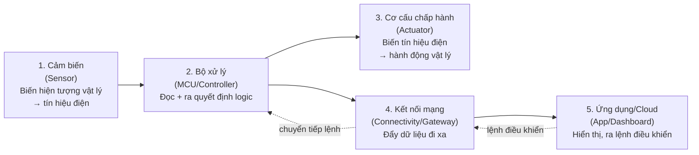

# 🌱 Kiến thức Nền tảng: Điện tử & IoT (Từ Zero)

Tài liệu này dành cho người **chưa có nền tảng điện tử/nhúng**, giải thích từ những khái niệm gốc nhất (điện áp, chip, GPIO) trước khi đọc tới [`kien_thuc_phan_cung_smartbin.md`](kien_thuc_phan_cung_smartbin.md) (tài liệu nói riêng về linh kiện trong dự án Smart Bin). Mục tiêu: đọc xong, bạn **tự lý giải được** vì sao người thiết kế mạch lại chọn cách làm này chứ không phải cách khác — thay vì học thuộc.

> Thứ tự đọc gợi ý: **Tài liệu này (nền tảng) → [Mục 1 của tài liệu Smart Bin](kien_thuc_phan_cung_smartbin.md#1-kiến-thức-nền-tảng-đọc-trước-nếu-bạn-mới-bắt-đầu) (nền tảng gắn với dự án) → các mục còn lại (chi tiết từng linh kiện).**

---

## 1. Điện tử cơ bản: Điện áp, Dòng điện là gì?

Trước khi nói tới chip, cần hiểu 2 đại lượng nền của mọi mạch điện — dùng phép ví von **nước chảy trong ống** cho dễ hình dung:

| Đại lượng điện | Đơn vị | Ví von với nước | Ý nghĩa |
|---|---|---|---|
| **Điện áp (Voltage — V)** | Volt (V) | Áp lực nước (chênh lệch độ cao giữa 2 bể chứa) | "Lực đẩy" khiến electron di chuyển. Không có chênh lệch (0V) thì không có gì chảy. |
| **Dòng điện (Current — I)** | Ampe (A) | Lưu lượng nước chảy qua ống mỗi giây | Lượng electron thực sự di chuyển qua dây dẫn. |
| **Điện trở (Resistance — R)** | Ohm (Ω) | Độ hẹp của ống nước | Cản trở dòng chảy. Ống càng hẹp (điện trở càng lớn), dòng chảy càng ít với cùng áp lực. |

Ba đại lượng này liên hệ với nhau qua **Định luật Ohm**: `V = I × R` — chỉ cần nhớ công thức này để hiểu vì sao mạch chia áp ở mục 7.3 (tài liệu Smart Bin) lại tính ra đúng 3.0V, hay vì sao Servo cần dây nguồn riêng (dòng lớn cần "ống to" riêng, không đi chung ống nhỏ của Arduino).

**GND (Ground/Mass) là gì?** Là điểm "0V" chung mà mọi phép đo điện áp trong mạch đều so sánh với nó. Hai chip khác nhau (Arduino, ESP8266) **bắt buộc phải nối chung GND** thì mới "nói cùng ngôn ngữ điện áp" — nếu không, con số HIGH/LOW ở chip này có thể vô nghĩa với chip kia.

---

## 2. Chip là gì?

- **IC (Integrated Circuit — mạch tích hợp):** Một miếng silicon nhỏ (vài mm²) khắc lên đó **hàng triệu đến hàng tỷ transistor** — mỗi transistor về bản chất chỉ là một **công tắc điện tử** bật/tắt cực nhanh (hàng triệu lần/giây), không có phần cơ khí di chuyển như công tắc thường. Tổ hợp hàng triệu công tắc bật/tắt đúng trình tự tạo ra được phép tính, phép so sánh, phép nhớ...
- **Microcontroller (MCU — vi điều khiển):** Là loại chip **gói chung vào 1 con** đầy đủ những gì cần để chạy 1 chương trình nhỏ: CPU (đơn vị tính toán) + RAM (bộ nhớ tạm) + Flash (bộ nhớ chương trình) + các khối ngoại vi (Timer, ADC, UART...). Ví dụ: ATmega328P (trên Arduino Uno), ESP8266, ESP32.
- **Khác gì so với CPU trong máy tính?** CPU máy tính (Intel/AMD) **không** có sẵn RAM/ổ cứng bên trong — chúng là linh kiện rời gắn ngoài qua bo mạch chủ, mạnh hơn rất nhiều nhưng cũng phức tạp và tốn điện hơn nhiều. MCU đánh đổi sức mạnh để lấy **sự gọn nhẹ, giá rẻ, tiêu thụ điện cực thấp** — rất phù hợp cho thiết bị IoT chạy pin, làm 1-2 việc chuyên biệt lặp đi lặp lại (đọc cảm biến, điều khiển động cơ) chứ không cần đa nhiệm như máy tính.

> **Vì sao dự án cần tới 2 chip (Arduino + ESP8266) thay vì 1?** Vì mỗi MCU có giới hạn tài nguyên riêng — Arduino Uno mạnh về xử lý I/O thời gian thực nhưng không có phần cứng Wi-Fi; ESP8266 có Wi-Fi nhưng nếu ôm luôn việc đọc cảm biến/servo thì dễ bị việc kết nối mạng (có độ trễ, có thể bị treo vài giây khi mất sóng) làm ảnh hưởng tới phần cơ khí. Tách vai trò rõ ràng giúp mỗi chip làm đúng 1 việc chuyên biệt và không "kéo" lỗi của khối này sang khối kia.

---

## 3. GPIO là gì?

**GPIO = General Purpose Input/Output** — chân vào/ra đa năng. Đây là khái niệm quan trọng nhất để hiểu cách MCU "chạm" vào thế giới thật.

- Một chip khi xuất xưởng có sẵn nhiều chân kim loại nhô ra ngoài (pin). Rất nhiều trong số đó là **GPIO** — nghĩa là chân **chưa định sẵn vai trò cố định**, vai trò của nó do **người lập trình quyết định lúc chạy** bằng lệnh như `pinMode()`.
- GPIO là **cây cầu duy nhất** giữa 2 thế giới:
  - Bên trong chip: chỉ có các con số 0/1, phép tính logic.
  - Bên ngoài chip: điện áp thật, cảm biến thật, động cơ thật.
- Một chân GPIO có thể được cấu hình làm nhiều "vai" khác nhau tùy thời điểm và tùy chip hỗ trợ:

| Vai trò cấu hình | Ý nghĩa | Ví dụ trong dự án Smart Bin |
|---|---|---|
| **Digital OUTPUT** | Chip chủ động đẩy điện áp ra ngoài (HIGH/LOW) | Chân Trig của HC-SR04 — Arduino đẩy xung 5V ra để kích cảm biến |
| **Digital INPUT** | Chip đọc điện áp từ bên ngoài đưa vào | Chân Echo của HC-SR04 — Arduino đọc lại tín hiệu phản hồi |
| **Analog INPUT (ADC)** | Chip đo giá trị điện áp liên tục (không chỉ 0/1) | Chân A0 đọc MQ-135 |
| **PWM OUTPUT** | Chip xuất xung bật/tắt nhanh với tỉ lệ thời gian bật thay đổi được | Chân D10 điều khiển góc quay Servo |
| **Chức năng đặc biệt (I2C, UART...)** | Chân được "mượn" cho một giao thức giao tiếp chuẩn | A4/A5 làm SDA/SCL cho LCD I2C |

> **Vì sao gọi là "đa năng"?** Vì **cùng một chân vật lý** có thể đóng các vai khác nhau tùy vào việc chip đó có hỗ trợ chức năng đặc biệt trên chân đó hay không, và tùy code cấu hình gì cho nó. Ví dụ D10 trên Uno vừa có thể là GPIO số thường, vừa có thể là ngõ PWM phần cứng (qua Timer1) — dự án Smart Bin tận dụng đúng khả năng PWM phần cứng này cho Servo (xem mục 6.2 tài liệu Smart Bin).

---

## 4. Kiến trúc chung của một hệ thống IoT

Mọi hệ thống IoT — dù là Smart Bin hay bất kỳ thiết bị nào khác — đều lặp lại đúng **5 lớp** sau. Nắm được sơ đồ này giúp bạn nhìn vào bất kỳ dự án IoT lạ nào cũng đoán được vai trò từng khối:

| Lớp | Vai trò | Trong Smart Bin là gì |
|---|---|---|
| **1. Cảm biến (Input)** | Biến hiện tượng vật lý (khoảng cách, nhiệt độ, khí gas...) thành tín hiệu điện mà MCU đọc được | HC-SR04, DHT11, MQ-135 |
| **2. Bộ xử lý (Processing)** | Đọc tín hiệu từ cảm biến, chạy logic quyết định ("có tay → mở nắp") | Arduino Uno |
| **3. Cơ cấu chấp hành (Output/Actuator)** | Biến quyết định logic thành hành động vật lý thật | Servo MG996R (đóng/mở nắp), Loa DFPlayer, LCD |
| **4. Kết nối mạng (Connectivity)** | Đẩy dữ liệu ra ngoài Internet và nhận lệnh từ xa về | ESP8266 (Wi-Fi + MQTT) |
| **5. Ứng dụng/Cloud (Application)** | Nơi con người xem dữ liệu và bấm nút điều khiển | Web Dashboard, Mobile App, MQTT Broker |

> Nhìn vào bảng này, mọi câu hỏi kiểu "vì sao lại cần linh kiện X" đều quy về được 1 trong 5 vai trò trên. Cảm biến luôn trả lời câu "đo cái gì, xuất ra Digital hay Analog"; cơ cấu chấp hành luôn trả lời câu "cần bao nhiêu dòng điện, có cần nguồn riêng không".

---

## 5. Firmware & vòng lặp `setup()` / `loop()`

**Firmware** là tên gọi cho chương trình chạy trực tiếp trên MCU (khác với "software" chạy trên hệ điều hành máy tính/điện thoại). Gần như mọi firmware nhúng đều theo đúng 1 khuôn mẫu:

- **`setup()`** — chạy **đúng 1 lần** khi vừa cấp điện: khởi tạo chân (`pinMode`), khởi tạo thư viện cảm biến, kết nối Wi-Fi... (giống bước "chuẩn bị" trước khi vào ca làm việc).
- **`loop()`** — chạy **lặp lại vô hạn** ngay sau `setup()`, hàng chục đến hàng nghìn lần mỗi giây: đọc cảm biến → xử lý logic → xuất tín hiệu → lặp lại (giống một ca làm việc lặp đi lặp lại mãi cho tới khi cúp điện).

Vì `loop()` chạy liên tục và **tuần tự từng dòng lệnh một** (MCU nhỏ không đa nhiệm thật sự như máy tính), nên nếu 1 dòng lệnh bị "đứng lại chờ" (ví dụ `delay()` hoặc chờ phản hồi mạng), **toàn bộ hệ thống bị đơ theo** — đây chính là gốc rễ của kỹ thuật `millis()` không dùng `delay()` đã nói ở tài liệu tóm tắt code.

---

## 6. Cách tư duy khi gặp một mạch/thiết kế lạ

Khi đọc nguyên lý một linh kiện hoặc một quyết định thiết kế mới mà chưa hiểu "tại sao lại làm vậy", hãy tự hỏi theo đúng thứ tự 4 câu này — đây cũng chính là 4 câu mà khung viết tài liệu ở mục 0 (tài liệu Smart Bin) đang dùng:

1. **Nó là Input hay Output?** (đọc dữ liệu vào, hay xuất hành động ra?)
2. **Nó giao tiếp bằng gì?** (Digital đơn giản? Analog? hay giao thức chuẩn như I2C/UART?)
3. **Nó cần bao nhiêu điện áp/dòng điện?** (có cần nguồn riêng, có cần bảo vệ mức điện áp không?)
4. **Nếu dùng cách "mặc định/thư viện có sẵn" thì có đánh đổi gì không?** (có bị block/treo chương trình không, có xung đột tài nguyên với linh kiện khác không?)

Trả lời được 4 câu này cho bất kỳ linh kiện nào, bạn sẽ tự suy ra được lý do thiết kế — thay vì phải học thuộc lý do có sẵn.

---

## 7. Bảng thuật ngữ nhanh (Glossary)

| Thuật ngữ | Giải thích 1 câu |
|---|---|
| **IC / Chip** | Miếng silicon chứa hàng triệu transistor (công tắc điện tử) |
| **MCU (Microcontroller)** | Chip gói sẵn CPU + RAM + Flash + ngoại vi, dùng cho thiết bị nhúng |
| **GPIO** | Chân đa năng của MCU, vai trò do lập trình quyết định |
| **Digital** | Tín hiệu chỉ 2 mức HIGH/LOW | 
| **Analog** | Tín hiệu liên tục, đo bằng ADC |
| **PWM** | Xung bật/tắt nhanh với tỉ lệ thời gian bật thay đổi được, giả lập tín hiệu tương tự |
| **UART/Serial** | Giao tiếp 2 dây TX/RX, cần cùng baud rate |
| **I2C** | Giao tiếp 2 dây SDA/SCL, nhiều thiết bị chung bus, phân biệt bằng địa chỉ |
| **RAM** | Bộ nhớ tạm, mất khi cúp điện |
| **Flash** | Bộ nhớ chương trình, không mất khi cúp điện |
| **EEPROM** | Bộ nhớ dữ liệu người dùng, không mất khi cúp điện, ghi/xóa được |
| **Firmware** | Chương trình chạy trực tiếp trên MCU |
| **Actuator** | Cơ cấu chấp hành, biến tín hiệu điện thành hành động vật lý |
| **GND** | Điểm 0V chung để so sánh điện áp |

---

> [!TIP]
> Sau khi đọc xong tài liệu này, quay lại đọc [Mục 1 của `kien_thuc_phan_cung_smartbin.md`](kien_thuc_phan_cung_smartbin.md) — lúc này các khái niệm Digital/Analog/UART/I2C/Logic Level ở đó sẽ dễ "ngấm" hơn nhiều vì đã có nền từ chip/GPIO/kiến trúc IoT ở tài liệu này.
